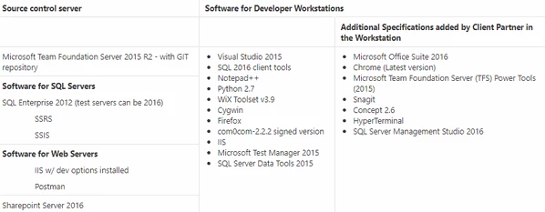
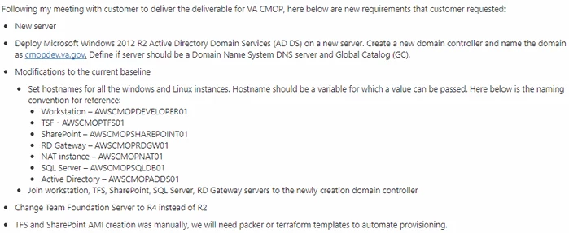
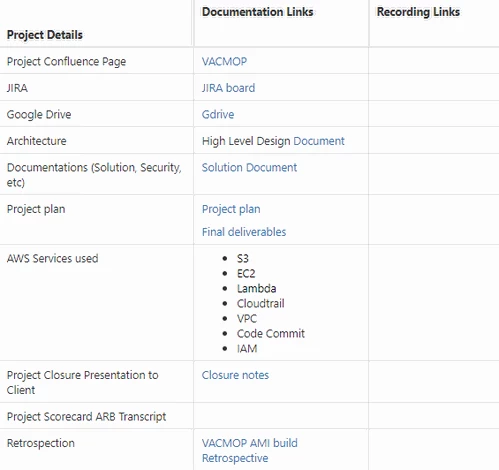
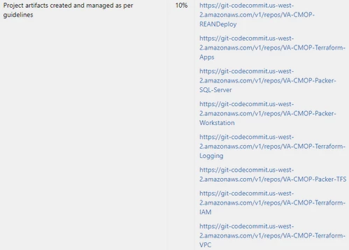
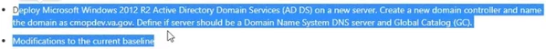
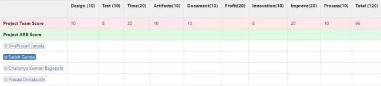
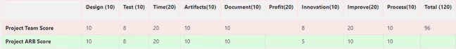

## VA CMOP Project Scorecard

**Video:** <https://recordings.join.me/ReyI2xAmk0K5TRQRTHMbOA>

**Speaker/Presenter:** Prasad, SivaPrasad J.

### Overview

> VA CMOP scoreboard process.

### About VACMOP

> In this project we developed some APIs and blueprints. APIs are deliverables. We mostly worked on Windows part.

### Tools Used

The following are the Tools used for this project.

We have successfully delivered this within the timeline.

### Technical Aspects

**SivaPrasad:** We build AMIs using Packers for workstations, etc. For SQL servers we have used Terraform, because it requires machine multiple reboots.

We gone through Chocolatey for implementing all the workstation softwares.

Other than the TFS, SQL server and Sharepoint we prepared Terraform scripts along with Powershell scripts.

While we are working on this project, we got new requirements from client as shown below.

We have build AMIs for them as well.

**Prasad:** This is US GovCloud project. We have developed blueprints and shared AMIs to Bernie. Bernie was executing the blueprints in GovCloud Env and we were supporting at that time.

### Project Details

**SivaPrasad:** The following table shows the details of project.

Since we don’t have Govcloud access, when we are building the infrastructure, we have used REAN Test for testing VPC validation and logging. For their environment we did a centralized logging as well.

#### Artifacts

Artifacts are listed below with Codecommit links.

### Innovations

We used different patterns for workstations and softwares for SQL server, TFS and Sharepoint.

We cannot directly go ahead and install the Sharepoint, because it requires multiple dependency software.

In microsoft website they are not providing valid dependency softwares, we have to go around to find the valid dependent softwares.

For SQL server, we used different patterns based on their requirements for installing the SQL server along with the SSR and SSI reporting tools.

### Improvements

**Prasad:** We followed the regular process of creating the JIRA board for ticketing purpose and track the project.

We use to send status report on daily basis.

After 2 weeks we have shared all the AMIs and Bernie executed them in GovCloud Env. We received feedback from the client.

Based on that we have raised one more CR to extent 1 more week of that project for completing the new requirements.

Configuring and testing took more time.

We are working on LOE part which shows how much time we are spending on the TFS and Sharepoints, which may help for our future project.

After these blueprints we have provided these for demo purpose.

Potentially we are using this for USTC project also.

#### Questions/Responses

**Q-Steve:** From the feedback perspective, how much your test scripts and your system works? Where would be the rework from delivering your code to client and creating it?

**R-SivaPrasad:** From the testing perspective, we used different tools for test cases by documenting it. In the GovCloud Env, Bernie ran the code. 

They changed the requirement, based on that we again went back, changed our codes and reinstalled the softwares.

**Q-Steve:** Give me one example what you consider as change of requirements?

**R-SivaPrasad:** The following is an example for requirement change for TFS and SharePoint.

Initially requirement was without active directory SharePoint and TFS has to be installed.

New requirement is they want active directory SharePoint and TFS has to be installed along with the SQL server.

Initially SQL server has to be delivered independently like one for TFS, one for SharePoint and another one for their internal.

New requirement is they need a centralized SQL server for all.

**Steve:** SharePoint doesn’t install without active directory. **It may be feedback to our sales team.**

**Prasad:** In the initial stage of this project we suggested Bernie to add AD for installing all of these servers.

### Scoreboard

The following is the scoreboard of the Regeneron project with their team score.

**Steve:** Your innovation score is too high that show you an artefact of the project is small. I will give you 5 for innovation.

For improvement of the project I will give 10, you have a process score that needs to come in. otherwise I can agree with your scores provided here.

Share that link to me, so that I can enter my score for this project.

I appreciate the blue print.
